# ScoreSharp.API

## API Endpoint 說明文件

### Endpoint 命名規則

| 端點名稱                | HTTP 方法 | 說明                        | 路由                                          |
| ----------------------- | --------- | --------------------------- | --------------------------------------------- |
| `Delete[XXX]ById`       | DELETE    | 根據 ID 單筆刪除，並返回 ID | `/[Controller]/Delete[XXX]ById/{id}`          |
| `Get[XXX]ById`          | GET       | 根據 ID 獲取單筆資料        | `/[Controller]/Get[XXX]ById/{id}`             |
| `Get[XXX]ByQueryString` | GET       | 根據查詢字串獲取多筆資料    | `/[Controller]/Get[XXX]ByQueryString?[query]` |
| `Insert[XXX]`           | POST      | 新增單筆資料，並返回 ID     | `/[Controller]/Insert[XXX]`                   |
| `Update[XXX]ById`       | PUT       | 根據 ID 更新單筆，並返回 ID | `/[Controller]/Update[XXX]ById/{id}`          |
| `BatchUpdate[XXX]`      | PUT       | 多筆更新                    | `/[Controller]/BatchUpdate[XXX]`              |
| `BatchInsert[XXX]`      | POST      | 多筆新增                    | `/[Controller]/BatchInsert[XXX]`              |

### 資料存取

1. 採用 EF Core 使用於簡單的 CRUD
2. 如複雜邏輯，採用 Dapper 製作客製化 Repository
3. Entity 與 DTO 不能共用切記

### 資料夾內容說明

Modules

- Auth (模組)
  - RouterCategory (Controller)
    - GetByString (Endpoint)
      - Models.cs
      - Examples.cs
      - Endpoint.cs
  - RouterCategoryController

| 名稱                     | 說明                           |
| ------------------------ | ------------------------------ |
| Auth                     | 驗證                           |
| RouterCategory           | 相當於 Controller 資料夾       |
| GetByString              | Endpoint                       |
| Models                   | DTO                            |
| Examples                 | NSwag 範本 Request 和 Response |
| Endpoint                 | 定義 Action 和 Handler         |
| RouterCategoryController | Controller                     |

### 範例 Code

於 Modules 新增一個模組資料夾 Auth，<br>
於 Auth 新增一個 Controller 資料夾 RouterCategory，<br>
於 RouterCategory 資料夾新增 RouterCategoryController

RouterCategoryController.cs

1. 將 class 改為 partial ，讓其他端點可以擴充
2. DI 注入 MediatR 套件為命令協調者

```C#

namespace ScoreSharp.API.Modules.Auth.RouterCategory;

[Route("[controller]/[action]")]
[ApiController]
[OpenApiTags("權限")]
public partial class RouterCategoryController : ControllerBase
{
    private readonly IMediator _mediator;
    public RouterCategoryController(IMediator mediator)
    {
        _mediator = mediator;
    }
}

```

Endpoint.cs

上半部 Action

1. namespace 需與 RouterCategoryController 同名才能使用 partial 擴充
2. 註冊 Action 以及撰寫 Swagger 文件
3. 利用 Mediator 告訴 Request 使其會去尋找相對應合約，並且返回相對應 Response

下半部 Handler

1. namespace 為資料夾
2. 利用 record 定義 Mediator 合約，合約可為 Query、Command
3. 實作 Handle 商業邏輯，可以盡情在 Handler 寫你自己的 Code
4. 如果遇到複雜邏輯資料處理可以採用 Dapper 客製化 SQL

```C#
using ScoreSharp.API.Modules.Auth.RouterCategory.GetRouterCatregoryByQuery;

namespace ScoreSharp.API.Modules.Auth.RouterCategory
{
    public partial class RouterCategoryController
    {
        /// <summary>
        /// 取得路由類別 ByQueryString
        /// </summary>
        /// <remarks>
        /// Sample QueryString:
        ///
        ///     ?RouterCategoryName=測試
        ///
        /// </remarks>
        /// <param name="request"></param>
        /// <returns></returns>
        [HttpGet(Name = "GetRouterCatregoriesByQueryString")]
        [ProducesResponseType(StatusCodes.Status200OK, Type = typeof(ResultResponse<List<GetRouterCategoriesByQueryStringResponse>>))]
        [EndpointSpecificExample(typeof(取得路由類別_2000_ResEx), ExampleType = ExampleType.Response, ResponseStatusCode = StatusCodes.Status200OK)]
        [OpenApiOperation("GetRouterCatregoriesByQueryString")]
        public async Task<IResult> GetRouterCatregoriesByQueryString([FromQuery] GetRouterCategoriesByQueryStringRequest request)
        {
            var result = await _mediator.Send(new Query(request));
            return Results.Ok(result);
        }
    }
}


namespace ScoreSharp.API.Modules.Auth.RouterCategory.GetByString
{
    public record Query(GetRouterCategoryRequest getRouterCategoryRequest) : IRequest<ResultResponse<List<GetRouterCategoryResponse>>>;

    public class Handler : IRequestHandler<Query, ResultResponse<List<GetRouterCategoryResponse>>>
    {
        private readonly ScoreSharpContext _context;
        private readonly CreditCardVerifyDapperContext _dapperContext;

        public Handler(ScoreSharpContext context, CreditCardVerifyDapperContext dapperContext)
        {
            _context = context;
            _dapperContext = dapperContext;
        }

        public async Task<ResultResponse<List<GetRouterCategoryResponse>>> Handle(Query request, CancellationToken cancellationToken)
        {
            // Todo ...
        }

        private async Task<Response> Get()
        {
            // Dapper Todo
        }
    }
}

```

Models.cs

1. 可以放置任何 Request 以及 Response 或者 DTO
2. 切記 request 與 response 必創，不可共用，無論 response 是否與 Entity 相同

```C#

namespace ScoreSharp.API.Modules.Auth.RouterCategory.GetByString;

public class GetRouterCategoryRequest
{
    // Todo ...
}

public class GetRouterCategoryResponse
{
    // Todo ...
}

```

Examples.cs

搭配 NSwag Example 撰寫範本 Request 、 Response

```C#

namespace ScoreSharp.API.Modules.Auth.RouterCategory.GetByString;

[ExampleAnnotation(Name = "[2000]取得成功", ExampleType = ExampleType.Response)]
public class GetRouterCategoryResponseExample : IExampleProvider<ResultResponse<List<GetRouterCategoryResponse>>>
{
    public ResultResponse<List<GetRouterCategoryResponse>> GetExample()
    {
        // Example data ...
    }
}


```

## NSwag.Example 說明文件

### 註冊

詳情可以觀看 Infrastructures => Nswag

### Endpoint Nswag 撰寫說明

撰寫時候可以對照圖片區塊去對應 Swagger

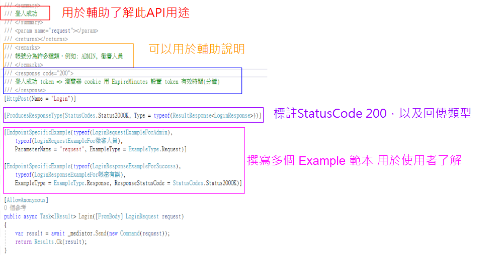

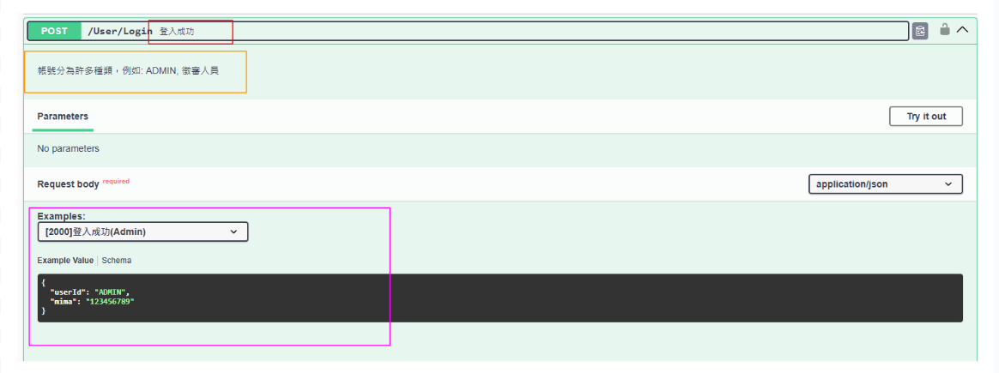

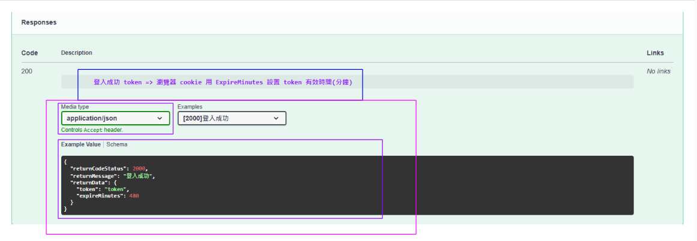

### Request 與 Response 範例

ExampleAnnotation 標籤

1. Name 範例 [returnCodeStatus]+敘述
2. ExampleType 分為 Request 及 Response

Class 命名原則

1. Request = > [中文 Action]\_returnCodeStatus_ReqEx
2. Response => [中文 Action]\_returnCodeStatus_ResEx

繼承 IExampleProvider<T>實作 Example，Request 及 Response 都來自於 Models

```C#
[ExampleAnnotation(Name = "[2000]登入成功-徵審人員", ExampleType = ExampleType.Request)]
public class 登入成功徵審人員_2000_ReqEx : IExampleProvider<LoginRequest>
{
    public LoginRequest GetExample()
    {
        LoginRequest request = new()
        {
            UserId = "HAHA",
            Mima = "123456789"
        };
        return request;
    }
}

[ExampleAnnotation(Name = "[2000]登入成功", ExampleType = ExampleType.Response)]
public class 登入成功_2000_ResEx : IExampleProvider<ResultResponse<LoginResponse>>
{
    public ResultResponse<LoginResponse> GetExample()
    {

        int expireMinutes = 480;
        var response = new LoginResponse
        {
            Token = "token",
            ExpireMinutes = expireMinutes
        };
        return ApiResponseHelper.Success(response, "登入成功");
    }
}
```

## EFCorePowerTools 說明文件

1. 延伸模組安裝
   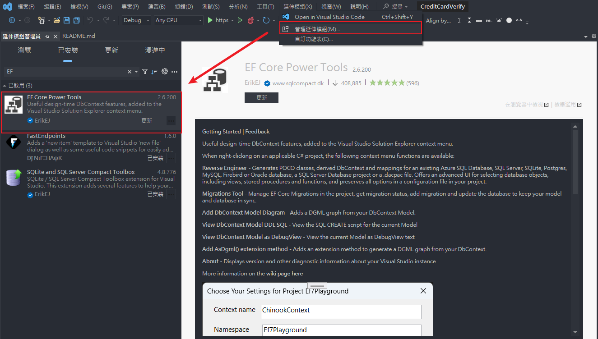

2. 如何使用

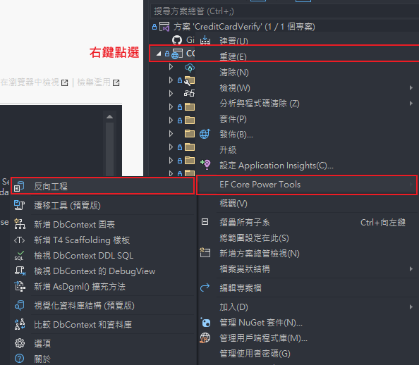

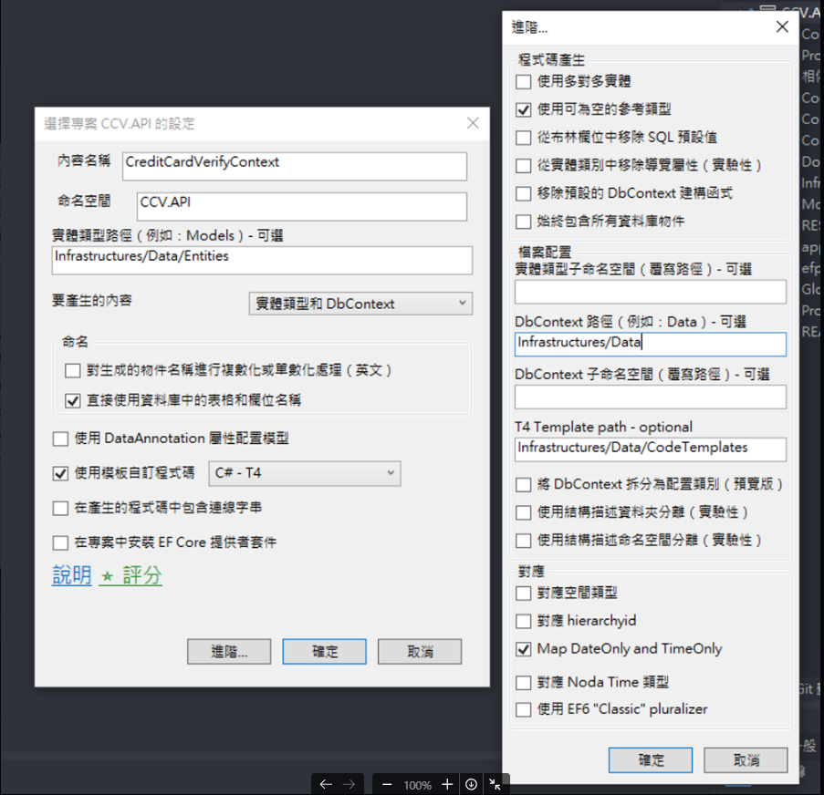

3. 開啟預存程序結果
   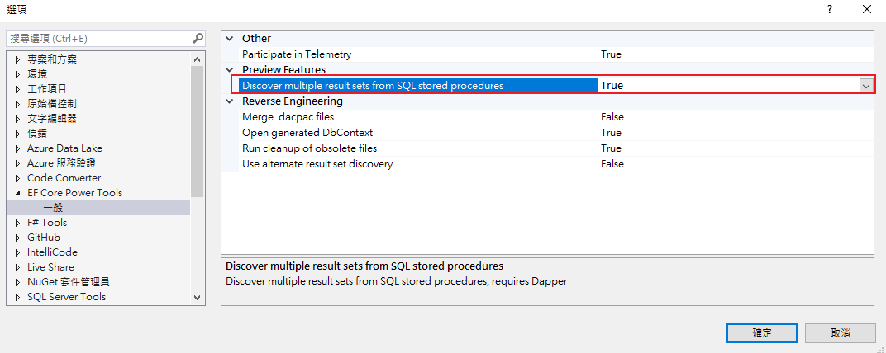
   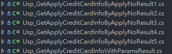

4. 設定 Entity 屬性為 Enum

可以參考 Documents 底下的 EFCore 反向工程自訂義 T4Template_Model 轉換 Enum.pdf

## Serilog + Seq 說明文件

### 註冊說明

1. 於 Infrastructures => Logging 進行註冊及開發
2. 於 Programs.cs 進行兩階段註冊，並利用 try catch 保護，得知程式死當 Log

```C#

// 註冊 Serillog (第一階段-全域註冊主因希望程式壞掉可以記錄到最後一筆)
SerilogConfig.AddSerilLog(config, env);

try
{
    // 註冊 Serillog (第二階段-服務註冊)
    builder.Services.AddSerilog();

    // other code ....

    var app = builder.Build();

    // Log request and response (利用中間層寫入 Req to Rsp Log)
    app.UseMiddleware<RequestResponseLoggingMiddleware>();
    app.UseSerilogRequestLogging(opts => opts.EnrichDiagnosticContext = SerilogConfig.EnrichFromRequest);

     // other code ....

}
catch (Exception ex)
{
    Log.Fatal(ex, "Application terminated unexpectedly");
}
finally
{
    Log.CloseAndFlush();
}


```

### 開發說明

1. 如何紀錄 Log

```C#
/// <summary>
/// 主要實作政策邏輯
/// </summary>
public class PermissionAuthorizationHandler : AuthorizationHandler<PermissionAuthorizationRequirement>
{
    // 1. DI 注入，T 型別為 class name 名稱
    private readonly ILogger<PermissionAuthorizationHandler> _logger;
    public PermissionAuthorizationHandler(ILogger<PermissionAuthorizationHandler> logger)
    {
        _logger = logger;
    }

    protected override async Task HandleRequirementAsync(AuthorizationHandlerContext context,
        PermissionAuthorizationRequirement requirement)
    {
        // 2. 使用參數化紀錄，主因在 Serillog 會將 PolicyName 設定成屬性,之後在 Seq 能方便查詢
        _logger.LogInformation("PermissionAuthorizationHandler => 處理政策為: {PolicyName}", requirement.PolicyName);

        // other code ...
    }
}
```

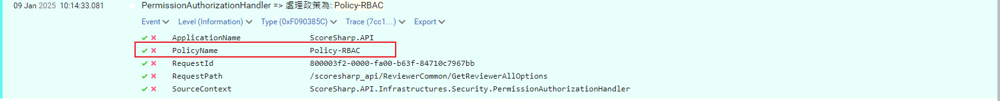

2. 物件解構寫法

當如果是物件需要紀錄可以採用解構寫法,將物件內部所有屬性拆解成單一屬性，主要就是多加「＠」

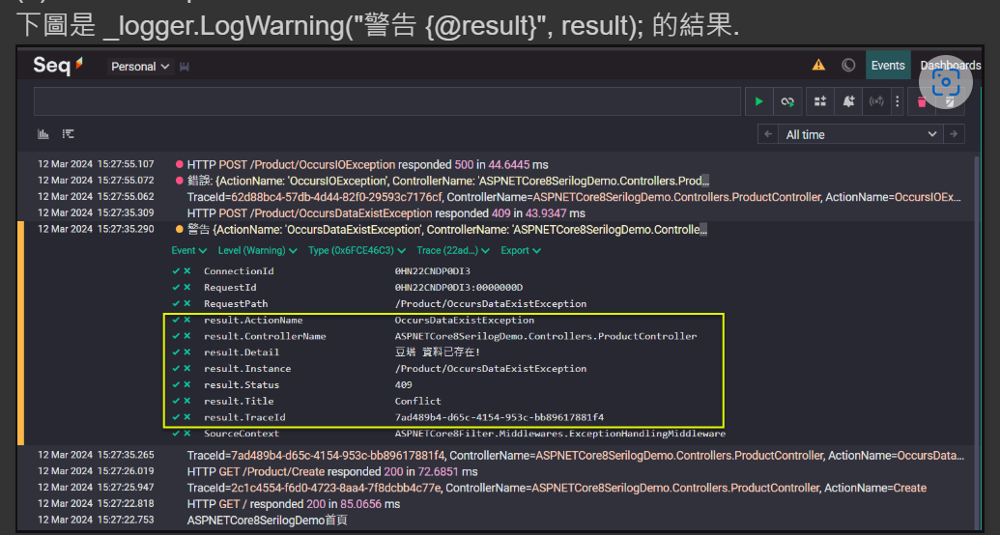

3. 提升 namespace Log 層級

有時候希望系統預設的 namespace 紀錄的 Log 希望不要紀錄，此時就要提升該 Log 層級，<br>
例如下面範例就是將 Microsoft.Hosting.Lifetime (namespace)調整成 Warning 才紀錄，<br>
如果需要查看一些系統預設 namespace 可以將 outputTemplate 設定成 new CompactJsonFormatter()並查看 SourceContext<br>

```C#
        // 全域設定
        /*  🔔new CompactJsonFormatter()
         *  由於 Log 的欄位很多，使用 Console Sink 會比較看不出來，改用 Serilog.Formatting.Compact 來記錄 JSON 格式的 Log 訊息會清楚很多！
         */
        var loggerConfiguration = new LoggerConfiguration()
            .MinimumLevel.Information() // 設定最小Log輸出
            .MinimumLevel.Override("Microsoft.AspNetCore", LogEventLevel.Warning)
            .MinimumLevel.Override("Microsoft.Hosting.Lifetime", LogEventLevel.Warning)
            // 由於 Log 的欄位很多，使用 Console Sink 會比較看不出來，改用 Serilog.Formatting.Compact 來記錄 JSON 格式的 Log 訊息會清楚很多！
            // .WriteTo.Console(new CompactJsonFormatter())
            .WriteTo.Console(outputTemplate: "[{Timestamp:HH:mm:ss} {Level:u3}] {Message:lj}{NewLine}{Exception}");
            .WriteTo.Seq(configuration.GetValue<string>("SerilLogConfig:SeqUrl")); // 寫入Seq

        Log.Logger = loggerConfiguration.CreateLogger();
```

new CompactJsonFormatter() 結果
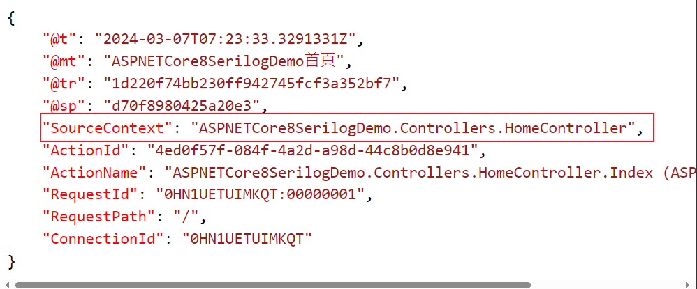

### Seq 查詢常用

1. 利用 RequestId 查詢前後文

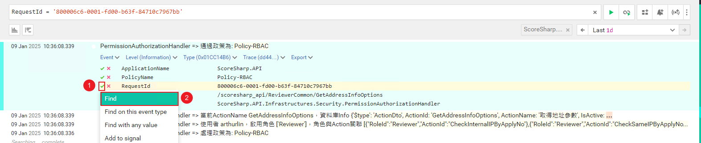

2. 利用客製化屬性紀錄，例如分專案 Log

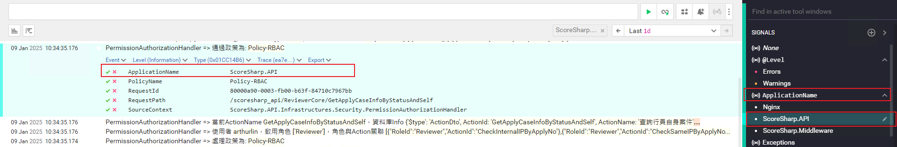

## 套件參考文章

| 套件             | 網址                                                                                       |
| ---------------- | ------------------------------------------------------------------------------------------ |
| NSwag            | https://github.com/vaclavnovotny/NSwag.Examples                                            |
| AutoMapper       | https://igouist.github.io/post/2020/07/automapper/                                         |
| Dapper           | https://blog.poychang.net/note-dapper/                                                     |
| SerilLog         | https://www.jasperstudy.com/2024/03/aspnet-core-8-mvc-serilog.html                         |
| JwtBearer        | https://blog.miniasp.com/post/2022/02/13/How-to-use-JWT-token-based-auth-in-aspnet-core-60 |
| MediatR          | https://code-maze.com/cqrs-mediatr-in-aspnet-core/                                         |
| EFCorePowerTools | https://blog.talllkai.com/ASPNETCoreMVC/2023/04/19/EFCorePowerTools                        |
| EFCore           | https://learn.microsoft.com/zh-tw/ef/core/                                                 |
| FusionCache      | https://github.com/ZiggyCreatures/FusionCache                                              |
| MiniExcel        | https://github.com/mini-software/MiniExcel/tree/master                                     |
| ULID             | https://github.com/Cysharp/Ulid                                                            |
| Serillog         | https://www.jasperstudy.com/2024/03/aspnet-core-8-mvc-serilog.html                         |
| LDAP             | Documents => LDAP 說明.pdf                                                                 |
| NSwag.Examples   | https://github.com/vaclavnovotny/NSwag.Examples                                            |
| PuppeteerSharp   | https://www.puppeteersharp.com/                                                            |

## Git Lab 說明文件

### 指令步驟

1. git stash
2. git pull origin master
3. git stash pop
4. 有衝突比較
5. commit (UI 比較好用)
6. git push origin master

### Commit Title

| title    | 說明          |
| -------- | ------------- |
| docs     | 文件更新      |
| feat     | 新增/修改功能 |
| fix      | fix bug       |
| refactor | 重構          |
| chore    | 安裝套件      |
