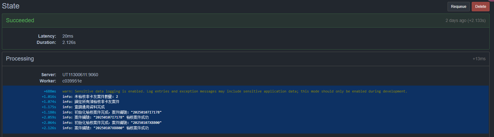
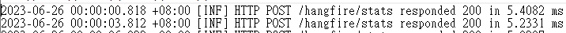
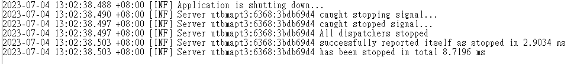
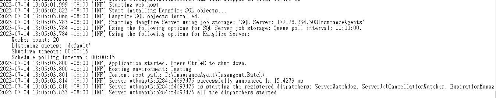
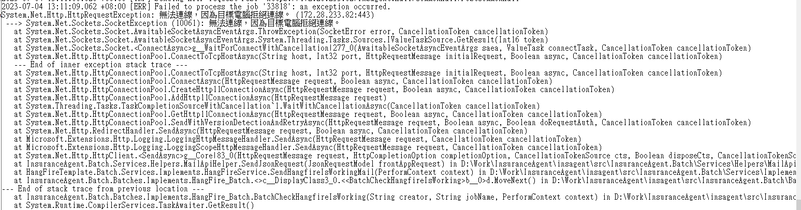
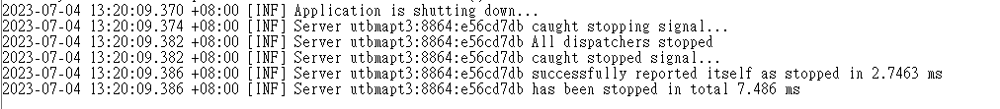

# ScoreSharp.Batch

## 套件參考文章

| 套件                        | 網址                                                                              |
| --------------------------- | --------------------------------------------------------------------------------- |
| NSwag                       | https://github.com/vaclavnovotny/NSwag.Examples                                   |
| AutoMapper                  | https://igouist.github.io/post/2020/07/automapper/                                |
| Dapper                      | https://blog.poychang.net/note-dapper/                                            |
| SerilLog                    | https://www.jasperstudy.com/2024/03/aspnet-core-8-mvc-serilog.html                |
| EFCorePowerTools            | https://blog.talllkai.com/ASPNETCoreMVC/2023/04/19/EFCorePowerTools               |
| EFCore                      | https://learn.microsoft.com/zh-tw/ef/core/                                        |
| ULID                        | https://github.com/Cysharp/Ulid                                                   |
| Hangfire                    | https://github.com/ldqk/Masuit.MyBlogs/tree/master/src/Masuit.MyBlogs.Core/Common |
| Hangfire.Console.Extensions | https://github.com/AnderssonPeter/Hangfire.Console.Extensions                     |
| Hangfire.Tags.SqlServer     | https://github.com/face-it/Hangfire.Tags                                          |
| FluentFTP                   | https://github.com/robinrodricks/FluentFTP                                        |
| HealthChecks                | https://github.com/healthchecks/healthchecks                                      |
| QRCoder                     | https://github.com/codebude/QRCoder                                               |
| Razor.Templating.Core       | https://github.com/soundaranbu/Razor.Templating.Core                              |

## 基礎建設

描述 `Infrastructures` 資料夾功能

| 資料夾              | 描述                                                                                                          |
| ------------------- | ------------------------------------------------------------------------------------------------------------- |
| Adapter             | 用於呼叫第三方的 API，主要參考 ScoreSharp.Common                                                              |
| Data                | 用於資料庫操作，主要工具為 EF Core ，副工具為 Dapper，資料庫為 SQL Server                                     |
| DependencyInjection | DI 注入                                                                                                       |
| Email               | 用於寄信，主要工具為 FluentEmail                                                                              |
| Hangfire            | 排程註冊與管理，主要工具為 Hangfire，資料庫為 SQL Server                                                      |
| HealthCheck         | 用於檢查服務健康狀態，主要工具為 HealthChecks                                                                 |
| Logging             | 用於記錄日誌，主要工具為 Serilog，目前 Log 採用 HangFire Dashboard 記錄，後續可以改為使用 Serilog File 紀錄   |
| Nswag               | 用於生成 Swagger 文件，主要工具為 NSwag，用於手動排程使用                                                     |
| Options             | 用於設定選項，主要工具為 Microsoft.Extensions.Options.ConfigurationExtensions，用於設定選項，例如 SMTP 設定等 |
| RazorTemplate       | 用於生成 Razor 模板，主要工具為 Razor.Templating.Core                                                         |

## 範例 HangFire Job

### 資料夾結構

Jobs

- EcardNotA02CheckNewCase (任務)
  - EcardNotA02CheckNewCaseJob (主要任務邏輯)
  - XXXDto
  - XXXHelper

### 開發程式碼

1. Queue 指定 Batch (當 API 也要使用到此 DashBoard 不各別指定會打架)
2. AutomaticRetry 是否自動 Retry
3. DisplayName 設定 HangFire 顯示名稱
   
4. 創建 Execute 方法

```C#
[Queue("batch")]
[AutomaticRetry(Attempts = 0)]
public class EcardNotA02CheckNewCaseJob()
{
    [DisplayName("[網路進件]非卡友檢核新案件 - 執行人員：{0}")]
    public async Task Execute(string createBy)
    {
        // code ...
    }
}

```

5. 可以參考 `ManualJobController`先使用手動執行進行開發，如果需要看 Log 可以打開 https://localhost:xxxx/hangfire 查看



### 註冊程式碼

1. 於 Infrastructures => Hangfie 進行註冊，使用 AddJobTask 方法進行任務註冊，可以查 Cron 如何設定循環時間

```C#

public static class HangfieConfig
{
    public static void ConfigureHangfire(this IServiceCollection services, IConfiguration config)
    {
        // code ...
    }

    public static void SetupHangfire(this IApplicationBuilder app)
    {
        // 使用私有的 AddJobTask 方法來註冊工作
        AddJobTask<ScoreSharp.Batch.Jobs.TestJob.JobService>("TestJob", job => job.Execute("System Execute Job"), "* * * * *");
    }

    private static void AddJobTask<T>(string id, Expression<Action<T>> job, string cron)
    {
        RecurringJob.RemoveIfExists(id);
        var options = new RecurringJobOptions { TimeZone = TimeZoneInfo.Local };
        RecurringJob.AddOrUpdate(id, "batch", job, cron, options);
    }
}
```

2. 於 Program.cs 進行服務註冊

```C#
try
{
    // Hangfire
    builder.Services.ConfigureHangfire(config);

    var app = builder.Build();

    app.UseHangfireDashboard(); // 註冊 HangFire DashBoard
    app.SetupHangfire(); // 註冊任務
}
catch (Exception ex)
{
    Log.Fatal(ex, "Application terminated unexpectedly");
}
finally
{
    Log.CloseAndFlush();
}

```

### 如何架設 HangFire

1. 參考此篇文章即可，但.NET CLR 可以設定無託管，[iis 架設](https://kodofish.medium.com/%E5%A6%82%E4%BD%95%E8%A8%AD%E5%AE%9A-asp-net-core-%E7%B6%B2%E7%AB%99%E6%87%89%E7%94%A8%E7%A8%8B%E5%BC%8F%E6%8C%81%E7%BA%8C%E5%9F%B7%E8%A1%8C%E5%9C%A8-iis-%E4%B8%8A-eb32ffc94179)

2. Hangfire 進行任務偵測我記錄 Log，可以將此 Log 層級調高



```C#
 .MinimumLevel.Override("Serilog.AspNetCore.RequestLoggingMiddleware", LogEventLevel.Warning)
```

3. 應用程式集區關閉/電腦重新啟動，SerilLog 會產出以下 LOG



4. 應用程式初始話模組自動幫你重開，所以必裝，API 因為有人去呼叫它是會自己起來但是 Hangfire 需要你手動點擊或者裝此模組才會幫你重啟



4. 應用程式初始話模組自動幫你重開，所以必裝，API 因為有人去呼叫它是會自己起來但是 Hangfire 需要你手動點擊或者裝此模組才會幫你重啟


5. 關掉網站其實它是以靠 IIS 裡面集區運行所以只是沒有網路



6. DLL 改變了所以假設你只是啟動或扯重新啟動網站沒有用，會一直停留，所以一定要打開網站或者重啟集區給它重跑單純重新啟動沒有用


